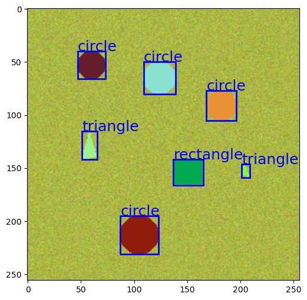

---
jupyter:
  jupytext:
    text_representation:
      extension: .md
      format_name: markdown
      format_version: '1.2'
      jupytext_version: 1.5.0
  kernelspec:
    display_name: Python [conda env:.conda-raains]
    language: python
    name: conda-env-.conda-raains-py
---

# Understanding Our Data

Our objective in this demo is to train a neural network to detect and classify simple 2D shapes set against a noisy background.

We will generate this data ourselves.
The following picture displays a representative image that we will generate, along with the associated "truth data", which consists of:
 - The bounding boxes that we want our model to produce, to indicate the bounds of the shapes that it detected.
 - Corresponding classification labels - "rectangle", "triangle", "circle" - that we want our model to ascribe to its detections.

Each image is 256x256 RGB, and contains 3 to 8 objects.
**The objects are guaranteed to be non-overlapping, and each will be 24 pixels to 40 pixels in length along the cardinal directions**.

**Note, however, that there seems to be a bug that can lead triangles to being smaller than desired.
We will see that this ultimately impacts the model that we trained.**

## Training and Validation Data

Our training data will consist of 1,000 images and the validation data will contain 200 independent images.
If we cared to do any hyper-parameter optimization or tweaking to our model to improve performance, then we would want to generate a separate set of test data to measure our model's final performance.

We have three data files for each of our training and validation sets:

- `images.npy` is a `float32` array of shape `(N, 256, 256, 3)`, where `N` is the number of images.
- `boxes.npy` is an `object` array of shape `(N,)`. Each of the elements is an `int32` array of 
   shape `(K, 4)`, where `K` is the number of objects in that image.
- `labels.npy`is an `object` array of shape `(N,)`. Each of the elements is an `int32` array of
  shape `(K,)`, where `K` is the
- number of objects in that image.

Our `boxes` array stores boxes in `(left, top, right, bottom)` format, which we refer to as
`xyxy`. We'll discuss the data in more detail when we get to it. 
