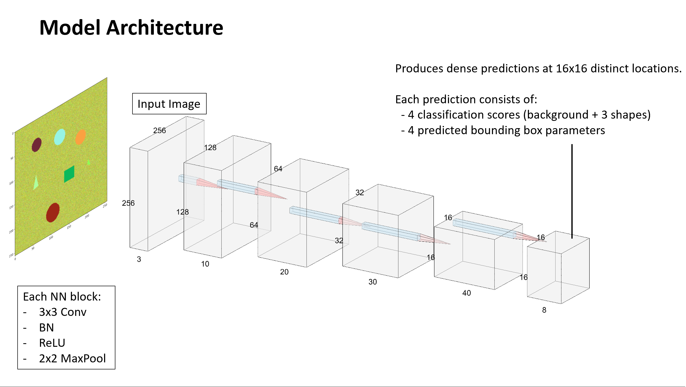
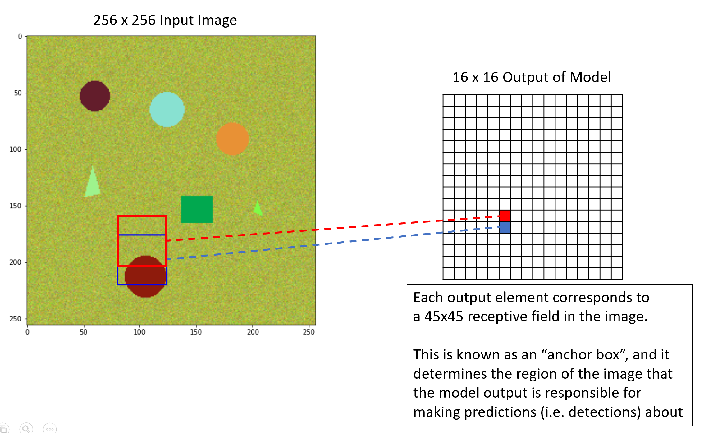
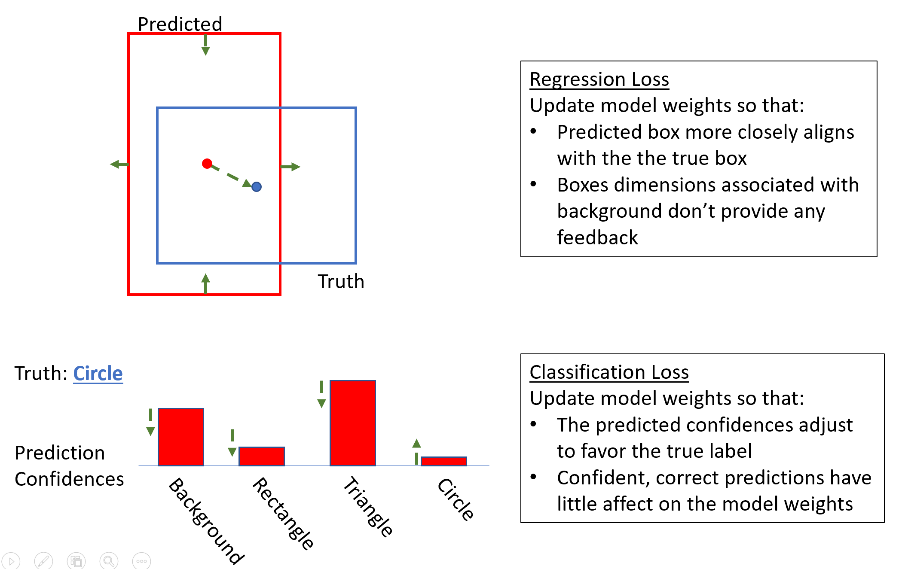

---
jupyter:
  jupytext:
    text_representation:
      extension: .md
      format_name: markdown
      format_version: '1.2'
      jupytext_version: 1.5.0
  kernelspec:
    display_name: Python [conda env:.conda-raains]
    language: python
    name: conda-env-.conda-raains-py
---

# Our Model

We are training a "single-stage" detector, based on the [RetinaNet in
the paper "Focal Loss for Dense Object Detection"](https://arxiv.org/abs/1708.02002).

## Single Stage Detection

Two stage object detectors, like [Faster RCNN](https://arxiv.org/abs/1506.01497), often operate first via a "region proposal stage", which generates a sparse set of candidate objects.
Then the second stage applies a classifier model to the candidates to classify them as a type of foreground object or as background, 

In contrast to two-stage detectors, our model will make predictions in a single stage - over a regular, dense sampling of potential object locations (this set of dense samples will be known as our "anchor boxes").
The model architecture is simple - it is simply a sequence of four conv-batchnorm-relu-maxpool blocks; each block produces an output that is downsampled to half of the size of its input.
Thus the model produces an output feature map whose spatial size is 1/16th that of the input image (in each dimension).

Thus the model will transform a 256x256 image into a 16x16 feature map.
The elements of this feature correspond to receptive fields - each 45x45 square pixels in extent - that densely cover the image.
Each entry in the feature map contains:
 - the four predicted classification scores associated with that receptive field (one for each of the three shapes and one for the background)
 - predicted offset of the associated anchor box's center and adjustments to its height and width
 

## Teaching Our Model: Loss Function

Our loss is the sum of two components:

1. The regression loss applies [smooth L1 loss](https://pytorch.org/docs/stable/generated/torch.nn.SmoothL1Loss.html) between the true and predicted bounding box centers (each scaled by the anchor box length), and the true and predicted bounding box extents (scaled by the anchor box width and log-scaled).

2. The [focal loss](https://arxiv.org/abs/1708.02002) adaptation to the softmax cross-entropy loss. This loss is designed to ameliorate the extreme class imbalance that occurs between background and foreground regions in images, by severely down-weighting contributions made by confident correct class predictions. Crucially, the accumulated loss summed over all of the anchor boxes is divided only by the number of true foreground anchor boxes. 

