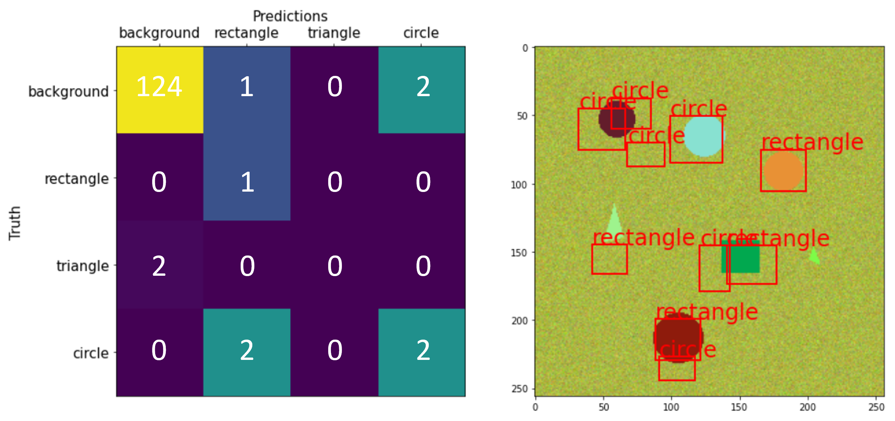
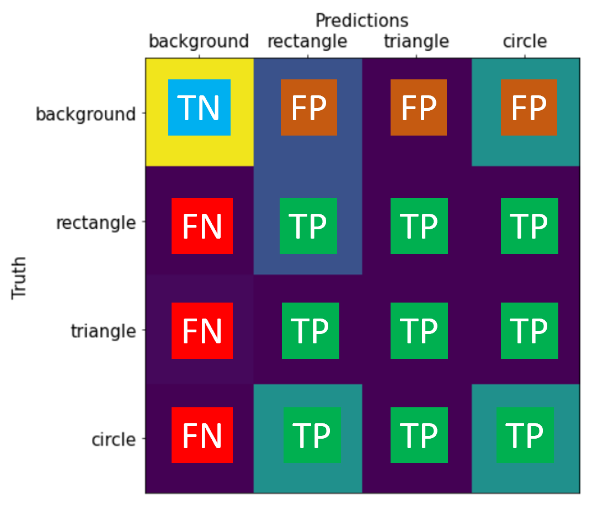
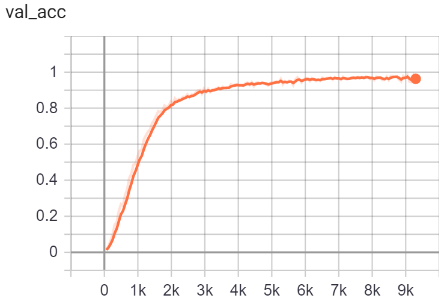
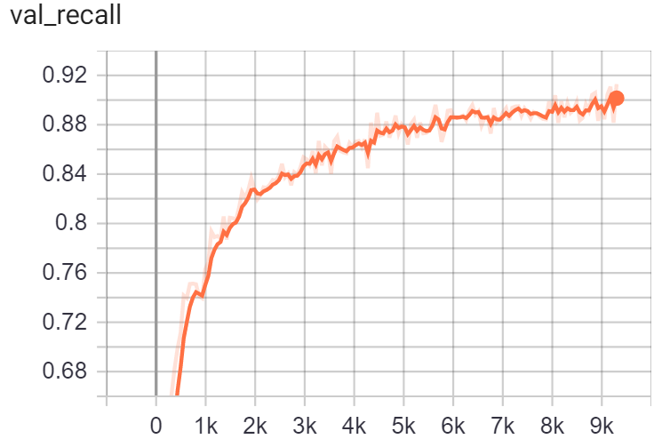
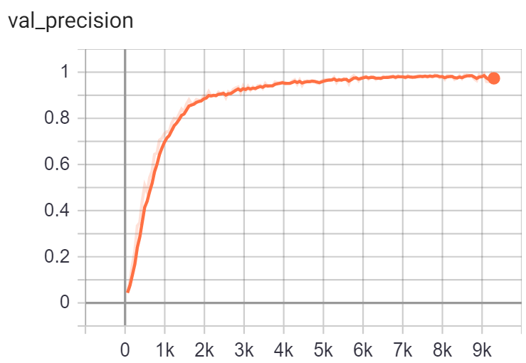

---
jupyter:
  jupytext:
    text_representation:
      extension: .md
      format_name: markdown
      format_version: '1.2'
      jupytext_version: 1.5.0
  kernelspec:
    display_name: Python [conda env:.conda-raains]
    language: python
    name: conda-env-.conda-raains-py
---

# Performance Metrics

We need to define reliable metrics to measure the quality of our model's detections.
This entails two things:
1. Assessing its ability to detect all of the objects that are present (no more, and no less), along with how well it localized those objects (i.e. how closely the predicted boxes match the true boxes)
2. Assessing how consistently the detected objects are classified correctly.

Both of these qualities can be assessed if we take our model's detections (post-NMS) and construct a so-called **confusion matrix** that compares the true objects to our predicted objects.

## Confusion Matrix

A confusion matrix displays all of the combinations of true/predicted categories that can manifest between our data's labels and our model's predictions.
Consider the following figure, which displays the confusion matrix associated with the truth/predictions for a single image.

This matrix essentially serves as a lookup table by which we can see how often the truth (row) aligns with a prediction (column).
For example, the entry at `(row-rectangle, col-triangle)` tells us how many true rectangles were (mis)classified as triangles.
Thus high tallies along the diagonals indicate good agreement between the truth and predictions, whereas off-diagonal elements convey misclassifications.

The confusion matrix affords us information that allows us to both assess the quality of our model's detections as well as the quality of the model's classifications.
Let's appreciate the diverse information conveyed by this matrix.

### Detection Metrics: Precision & Recall
As far as our detections are concerned (i.e. we only care about whether we detect/localize all objects, not that we classify them correctly), we care about four different categories of predictions from our models; each pertains to an anchor box that has been retained by NMS:
- True negatives (TN)
  - overlaps only with background is categorized as "background".
- True positives (TP)
  - overlaps sizeably with an object is *not* categorized as background.
- False negative (FN)
  - overlaps sizeably with an object is **incorrectly categorized** as background.
- False Positives (FP)
  - overlaps only with background is **incorrectly categorized** as foreground.
  
This permits us to compute the precision and recall of our detections.

\begin{equation}
\mathrm{Precision} = \frac{tp}{tp + fp} = \frac{5}{5+3} \approx 0.63 \\
\mathrm{Recall} = \frac{tp}{tp + fn} = \frac{5}{5 + 2} \approx 0.71 \\
\end{equation}

### Classification Metrics: Accuracy Among Positives

Lastly, we can further distinguish the true positives _along the diagonal_ as **correct positives**;
then the classification accuracy (among positives, so that background examples don't dominate the metric) is the fraction of correct foreground predictions among all foreground predictions

\begin{equation} 
\mathrm{Accuracy} = \frac{\mathrm{Number\;Correct}}{\mathrm{Number\;Predicted}} = \frac{3}{8} \approx 0.38 \\
\end{equation}

## Tracking the Progress of Our Model as It Learns

The following plots convey the progress that our model makes when it trains on 150 epochs of our training data set (without any train-time augmentations).
All of the following metrics were generated by evaluating our model on a distinct validation dataset.

